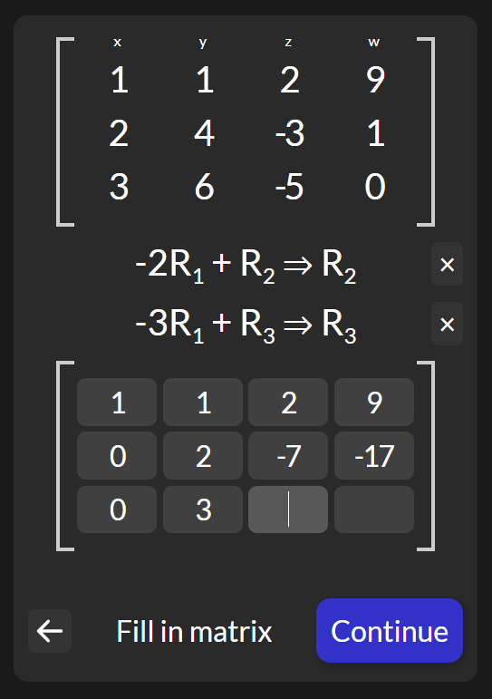

# Matrix Assistant
Matrix Assistant is a web app that helps users learn how to solve matrices through step-by-step guidance and error detection.

Project is currently hosted at [https://benjamin-cates.github.io/matrix_assistant](https://benjamin-cates.github.io/matrix_assistant)

## Features
- Elementary row operations: Performs operations such as swapping rows, swapping columns, multiplying rows, and adding rows.
- Fraction support: The app can handle matrices with fractional entries.
- Autofill: A mode where the row operations are performed for you, useful for learning the steps in the row reduction algorithm
- Error detection: The app checks for common mistakes such as incorrect multiplication or addition and points them out to the user.

## How to use
1. Start by entering the matrix you want to solve in the input fields.
2. Add your suggested next row operations
3. Fill out the matrix with the row operations performed
4. If you made any mistakes, the program will notify you based on your selected difficulty level
5. Continue solving the matrix until it is in reduced row echelon form.

## Additional Resources

[Solving systems of equations with row operations](https://textbooks.math.gatech.edu/ila/row-reduction.html)

[Khan Academy Linear Algebra course](https://www.khanacademy.org/math/linear-algebra)
